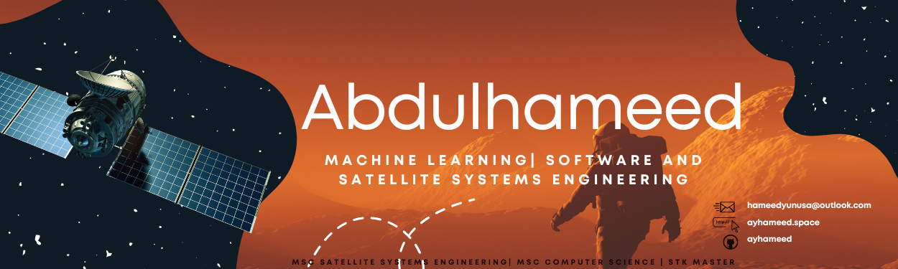

# 👋 Hi, I’m Abdulhameed

## 👤  About Me
I'm a passionate developer with a strong interest in building data-driven solutions, particularly fascinated by the possibilities of space exploration and how Machine Learning can be applied to this field. In my free time, I enjoy learning about AI and keeping up with the latest advancements in technology.

## 🚧 Current Projects
### 🔥 Fire-Detection from Satellite Imagery Using Machine Learning
- Developed a machine learning model that processes satellite imagery, employing GANs for data augmentation to achieve a remarkable 90% reduction in model size and 96% decrease in dataset requirements. This optimization enables deployment in resource-constrained environments like spacecraft.
  
### ☁️ Cloud Detection Model
- Engineered a highly accurate (96%) cloud detection model utilizing a mere 10MB of data. Leveraged cloud IFass for enhanced performance.

### 🌐 Web Dashboards in React
- Created interactive dashboards that boosted user engagement with data visualizations by 45%.
  
### 🪐 Space Mission Optimization and System Design
- Successfully simulated a space mission using STK, optimizing communication channel switching by 26% through machine learning analysis.

## 🏆 Expertise
- **🖥️ Backend Development**: Adept at building scalable and secure backend systems using technologies like Node.js, Express, and MongoDB.
- **📊 Data Science & Machine Learning**: Experienced in building and deploying ML models in Python libraries like TensorFlow and PyTorch (IBM Data Science Professional Certified).
- **🚀 Space Mission and Systems Modelling**: Skilled in using Ansys STK to simulate complex space missions and leverage ML for deeper insights.

## 🗣️  Talks and Conferences 
- UK Space Conference 2023 (Satellite Edge Computing for Real-Time Satellite Imagery Segmentation )
- SatNex School V (Artificial Intelligence (AI) for Satellite Systems)

## 📫 Let's Connect
- Website: https://www.ayhameed.space/
- LinkedIn: https://uk.linkedin.com/in/abdulhameed-yunusa
- Email: hameedyunusa@outlook.com

## 🛠️ Technologies & Tools

###

  
  

###

<!---
ayhameed/ayhameed is a ✨ special ✨ repository because its `README.md` (this file) appears on your GitHub profile.
You can click the Preview link to take a look at your changes.
--->
